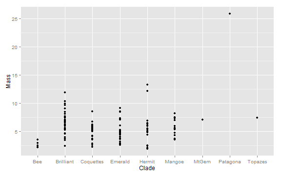
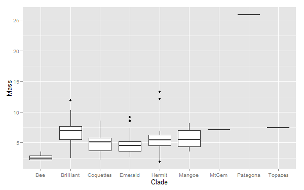
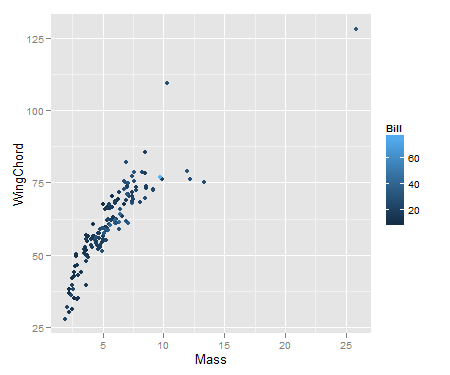
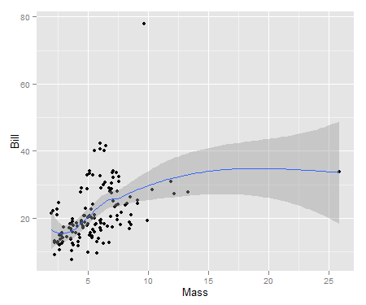
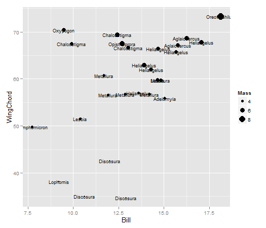

 

As scientists, our major currency is data. R provides a common ground for data analysis. Using R for data visualization, exploration, and analysis opens up a massive set of tools. 

You will find that nothing, absolutely nothing, you will do has not been atleast tried before. There are packages covering every imaginable type of ecological, evolutionary, and statiscal approaches. Today we will discuss how to read in data, perform basic functions, and produce figures. 

---

Tips for Importing Data
=======================
R is not a spreadsheet application. Enter data in excel or access, and export it to R for analysis. 

Data is easiest to read in a .csv format, in excel, save as -> comma seperated csv. 

Avoid Spaces, Special Characters, or hanging lines of data.

---

```r
traits <- read.csv("C:/Users/Jorge/Documents/IntroR/05-DataExploration/Traits.csv", 
    row.names = 1)
```

---
<!-- html table generated in R 3.0.1 by xtable 1.7-1 package -->
<!-- Tue Jan 14 11:34:46 2014 -->
<TABLE border=1>
<TR> <TH>  </TH> <TH> Clade </TH> <TH> Genus </TH> <TH> Species </TH> <TH> double </TH> <TH> English </TH> <TH> Bill </TH> <TH> Mass </TH> <TH> WingChord </TH>  </TR>
  <TR> <TD align="right"> 1 </TD> <TD> Coquettes </TD> <TD> Adelomyia </TD> <TD> melanogenys </TD> <TD> Adelomyia melanogenys </TD> <TD> Speckled Hummingbird </TD> <TD align="right"> 15.04 </TD> <TD align="right"> 4.25 </TD> <TD align="right"> 55.87 </TD> </TR>
  <TR> <TD align="right"> 2 </TD> <TD> Brilliant </TD> <TD> Aglaeactis </TD> <TD> cupripennis </TD> <TD> Aglaeactis cupripennis </TD> <TD> Shining Sunbeam </TD> <TD align="right"> 18.71 </TD> <TD align="right"> 8.44 </TD> <TD align="right"> 85.62 </TD> </TR>
  <TR> <TD align="right"> 3 </TD> <TD> Coquettes </TD> <TD> Aglaiocercus </TD> <TD> coelestis </TD> <TD> Aglaiocercus coelestis </TD> <TD> Violet-tailed Sylph </TD> <TD align="right"> 16.25 </TD> <TD align="right"> 6.07 </TD> <TD align="right"> 68.68 </TD> </TR>
  <TR> <TD align="right"> 4 </TD> <TD> Coquettes </TD> <TD> Aglaiocercus </TD> <TD> kingi </TD> <TD> Aglaiocercus kingi </TD> <TD> Long-tailed Sylph </TD> <TD align="right"> 15.77 </TD> <TD align="right"> 5.53 </TD> <TD align="right"> 67.12 </TD> </TR>
  <TR> <TD align="right"> 5 </TD> <TD> Emerald </TD> <TD> Amazilia </TD> <TD> amazilia </TD> <TD> Amazilia amazilia </TD> <TD> Amazilia Hummingbird </TD> <TD align="right"> 18.54 </TD> <TD align="right"> 4.07 </TD> <TD align="right"> 53.33 </TD> </TR>
  <TR> <TD align="right"> 6 </TD> <TD> Emerald </TD> <TD> Amazilia </TD> <TD> castaneiventris </TD> <TD> Amazilia castaneiventris </TD> <TD> Chestnut-bellied Hummingbird </TD> <TD align="right"> 18.70 </TD> <TD align="right"> 4.75 </TD> <TD align="right"> 52.70 </TD> </TR>
   </TABLE>


---
Data Explortation
-------------------

It is critical to consider your data carefully. Are they categorical, are they numeric, how much variance is there? Are they complete?
For categorical data, the best place to start are contingency tables
How many speccies per clades are there?
For continues data, try *range*, *sd* *mean*

```r
table(traits$Clade)
```

```
## 
##       Bee Brilliant Coquettes   Emerald    Hermit    Mangoe     MtGem 
##         5        37        27        34        22        13         1 
##  Patagona   Topazes 
##         1         1
```

```r
mean(traits$Bill)
```

```
## [1] 21.41
```


---
**Try It!**
------------
1. What are the range of body sizes? 
2. Which genus has the most species?
3. Look up the which.max function; read the help screen; which species has the longest bill?
4. Create a two way table of genus and clade, what does this show?


---
ggplot2
-----------------

The ggplot library is the gold-standard for plotting. It allows basic, intuitive, plots that can be endlessly customized. The help screens are full of clear examples, and there is a massive online community to search basic plotting questions. Let's explore our first plot.


```r
library(ggplot2)
```


---&twocol

*** left


```r
ggplot(traits, aes(x = WingChord, y = Mass)) + geom_point()
```

 


*** right
-    **Parsed**: Create a plot from the data frame traits, with matching the datatype and properties of the column WingChord on the x axis, and Mass on the Y axis. Add points. 

---

For now, we will always be setting global aesthestics inside the *ggplot()* and not the *geom_point()*.


```r
ggplot(traits, aes(x = Clade, y = Mass)) + geom_point()
```

 

```r
# What if we want something besides points
```


---
There are many geom styles type **geom_** and hit tab to see types, and then get help using ?geom_nameofgeom 

```r
ggplot(traits, aes(x = Clade, y = Mass)) + geom_boxplot()
```

 


---&twocol

Building more complex plots
---------------------------

*** left
- **Continious colors can be added (and edited) to add more information**
- **Parsed**: Create a plot from the data frame *traits*. The x axis is the column *Mass*, the y axis is the column *WingChord*, color the data by the continious variable column *Bill*. Add points. 

*** right

```r
p <- ggplot(traits, aes(x = Mass, y = WingChord, color = Bill))
p + geom_point()
```

 


---&twocol

Building even more complex plots
===============================
Shapes and sizes can be added as well, note how ggplot automatically groups by both variables. In this case we have a bit too many to make it helpful, but it depends on your data.

*** left
- **Parsed**:Create a plot from the dataframe traits, with Mass on the x axis, WingChord on the y. Color the data by the continious variable Bill, and add shapes to the data based on the categorical data Clade. Add points. 

*** right 


```r
ggplot(traits, aes(x = Mass, y = WingChord, color = Bill, shape = Clade)) + 
    geom_point()
```

 


-ggplot is very smart. Trust it.

---

Shapes and sizes can be added as well, note how ggplot automatically groups by both variables. In this case we have a bit too many to make it helpful, but it depends on your data.


```r
ggplot(traits, aes(x = Bill, y = WingChord, color = Clade, size = Mass)) + geom_point()
```

 

ggplot is very smart. Trust it.

---

**Try it!**
------------

1. Plot **Bill** as a function of **Wingchord**, save it as object p
2. Plot **Bill** against clade, which clade has the lowest median bill size?
3. Look up geom_histogram, what does it go? made a histogram of **Bill** sizes.
4. Color your histogram by clade, which clade does the outlier belong to?

---

Adding multiple geometries to a plot
------------------------------------

Often we want to express more information than a single geometric object, ggplot allows us immense flexiblity by allowing us to build on our initial plot


```r
ggplot(traits, aes(x = Mass, y = Bill)) + geom_point() + geom_smooth()
```

 


---
Practice plotting
====================
To show some more features, let's make a bit smaller dataset

Given a bit smaller dataset, we can explore more options, add both color and shape, drawing on what we've done already, how would we subset our data to just get the coquettes clades?


---

```r
coq <- droplevels(traits[traits$Clade == "Coquettes", ])
```


---
Text can be added, and manipulated directly
============================================


```r
ggplot(coq, aes(x = Bill, y = WingChord, size = Mass, label = Genus)) + geom_point() + 
    geom_text(size = 3)
```

 


---
Data can be facetted into panels

```r
ggplot(coq, aes(x = Species, y = WingChord, col = Bill, size = Mass)) + geom_point() + 
    facet_grid(~Genus, scales = "free") + theme(axis.text.x = element_text(angle = -90)) + 
    scale_color_continuous(low = "blue", high = "red") + ylab("Wing Length")
```

 

**Parsed**: Plot the dataframe coq, with Species on the x axis, with WingChord on the y axis, color the data by Bill size, and adjust the size of the data based on Mass. Add points. Create a panel for each Genus, make the x axis different for each panel. Rotate the x axis labels by 90degrees. Change the color of the Bill size from blue to red. Label the y axis "Wing length"

---
10min Group Assignment
=================

Come up with a simple question and represent it graphically

---
Exporting Dataframes
=======

If we want to export the data that we created, we can save it to file as a csv


```r
write.csv(coq, "Coquettes.csv")
```


